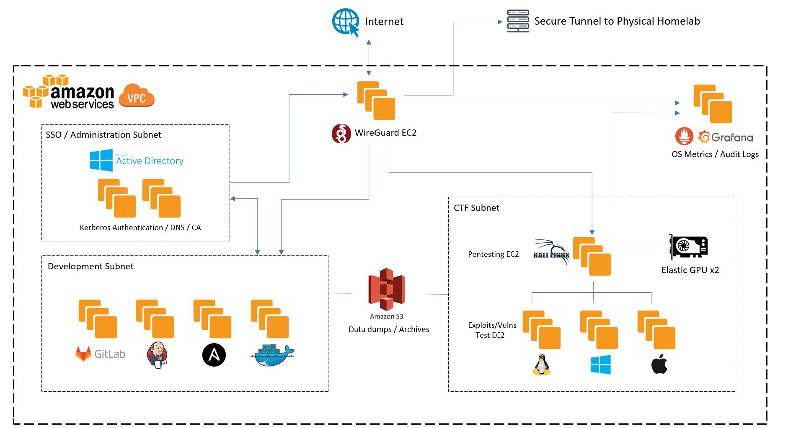

# Vishnuvardhan S

 

---
      
## About
- 💼 Currently working at Amadeus Labs as a DevOps Engineer
- 💻 I contribute to open-source projects, participate in CTFs and bug-bounty programs.
- 🚀 Looking to move into SecOps / Cybersecurity, working on my OSCP certification.

## Tech Stack
- **Web Development:** Python + Flask/Django
- **Scripting:** Python, Bash, PowerShell
- **DevOps:** Git, Ansible, Jenkins, Terraform, Docker, Kubernetes, AWS and OpenShift
- **OS Administration:** Windows Server 2012,2016,2019 / Active Directory / Red-Hat Linux 7,8

## My Virtual Homelab
- I maintain a private cloud homelab hosted in AWS. Its accessible securely from anywhere on the internet and hosts some of the tools/services that
I use often.

